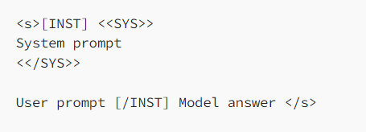

## **SQLGeneratorSage: Insights from a  LLaMA Model(meta-llama/Llama-2-7b-chat-hf) trained on synthetic SQL generated data**

  This is the repo for the Gen-AI project which aims to build and generate SQL queries based on the prompt provided to the Llama model. Finetuning(mainly using LoRA & QLoRA) was performed to check if there was an improvement in the performance of the model. 
  
  
  This repo contains:
  * The 80k data used for used fine-tuning the model.
  * The code for generating the data in a format acceptable by the model.
  * The adapter/fine-tuned model folder having weights that can be reused with a Llama-2-7b-chat-hf model to help generate SQL queries.  
 
  #### Overview:
  -----------------------------
  In this project, I fine-tuned a Llama-2-7b-chat-hf model with 7 billion parameters on a T4 GPU with high RAM using Google Colab. I noticed that a T4 only has 16 GB of VRAM, which was barely enough to store Llama 2–7b's weights (7b × 2 bytes = 14 GB in FP16). Additionally, I had to consider the overhead due to optimizer states, gradients, and forward activations. This meant that a full fine-tuning was not possible: I needed to use parameter-efficient fine-tuning (PEFT) techniques like LoRA or QLoRA.
  
  I fine-tuned the model in 4-bit precision to drastically reduce the VRAM usage, which is why I used QLoRA. I leveraged the Hugging Face ecosystem with the transformers, accelerate, peft, trl, and bitsandbytes libraries.


  #### About the Dataset used:
  --------------------------------
  gretelai/synthetic_text_to_sql is a large, diverse synthetic Text-to-SQL dataset created with Gretel Navigator, available under Apache 2.0 license.
  Key features:

* 105,851 records (100,000 train, 5,851 test)
* ~23M total tokens, ~12M SQL tokens
* 100 distinct domains
* Covers various SQL tasks and complexity levels
* Includes database context, explanations, and training tags

  As of April 2024, it's the largest synthetic text-to-SQL dataset available. This dataset showcases Gretel's capabilities in creating tailored synthetic data for specific use cases and advancing data-centric AI.


  Dataset Link: https://huggingface.co/datasets/gretelai/synthetic_text_to_sql
  
 #### Data Release
  --------------------------------------------------------------------------------------------------------------------------------------
  
  <provide folder path here> contains 80,000 rows of data which mainly consists of CREATE TABLE statements and INSERT ROW statements followed by a question. Each row of the dataset is provided in a specific format which is accepted by the model. We will split the dataset into a 80:20 ratio of train and test respectively(setting a seed while doing so). From the test set will randomly select 50 samples and note the output provided by the model before finetuning and note the output of the model after finetuning.
  
 **In case of Llama 2, the following prompt template is used for the chat models:**
 
 1\. System Prompt (optional) to guide the model
 
 2\. User prompt (required) to give the instruction
 
 3\. Model Answer (required)
 
 4\. See the picture below:
 
 
	   
 Keep in mind that this format is used only while fine tuning the LLama model but during other situations(like just using the base model to the check the ouput) it is not mandatory to adhere to this format when trying to provide a user prompt. So in order to extract the required input prior to finetuning we would need regex to achieve this for the 50 random samples that we choose. Keep in mind that we would be extracting/limiting the text excluding the 'Model Answer'. This can be seen in the below code block.
	   
	   
	   
 ```
	   default_system_prompt="Answer the question to the best of your ability. try atleast answering with whatever SQL knowledge(MS SQL server flavour) that you have. Please consider the context below if applicable"
	   
	   import re
	   
	   
	   def extract_inst_text(text):
	     pattern = r'\[INST\](.*?)\[\\INST\]'
	     matches = re.findall(pattern, text, re.DOTALL)
	     return matches
	   
	   
	   # Example usage
	   
	   sample_text = hg_dataset_test['text'][18483]
	   question = extract_inst_text(sample_text)
	   question[0] = (question[0] + 'Answer this by writing the sql query for this question')
	   
	   
	   #Initialize the hugging face pipeline
	   
	   def format_prompt(question):
	       return f'''<s> [INST] <<SYS>> {default_system_prompt} <</SYS>> {question} [/INST]'''
 ```
	   
	                                                                < insert image here >
																	
	
	
	
	

 ##### Finetuning
 -------------------------------------------------------------------------------------------------------------------------------
 
 Finetuned the model(NousResearch/Llama-2-7b-chat-hf  model is the model that needs to be trained from the Hugging Face hub) using standard Hugging Face training code and deepspeed with the following hyperparameters:
 
   | Hyperparamter |Value |
   | ------------- |:----:|
   | Learning rate | 2e-4 |
   | Epochs	       |  1   |
   | max_seq_length| None |
   | weight_decay  | 0.001|
   
  
  The fine tuned model is then saved for testing with the test data to see if there was any improvement in the response of the model. The fine tuned model is stored in the <folder>. The code for using this fine tuned model can be found here <provide link to the code>


##### Results
----------------------------------------------------------------------------------------------------------------------------------------------------------

The results of the data(test data) can found here. Prior to finetuning out of 50 randomly picked samples only 24 questions were given the correct response by the model. After finetuning there was an increase in the number of correct results by 15. _**By finetuning using Qlora we observed a 30% increase in improvement in the model**_. Further investigation with respect to various other PEFT techniques can be explored to see if a better improvement can be achieved comapred to this QLORA technique.
  